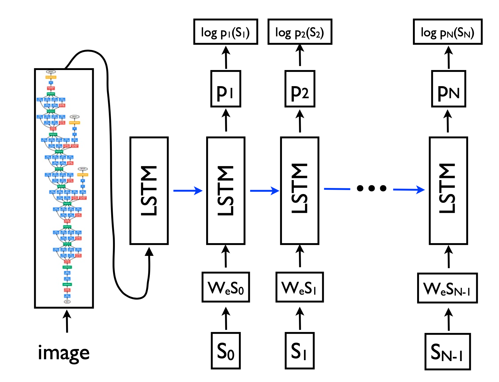

# NIC-2015-Pytorch
This project is the Pytorch implementation of Neural Image Captioning 2015 paper by Vinyals et. al.<a href = "https://arxiv.org/abs/1411.4555">[PDF]</a> 
<ul>
  <li><b>Backend :</b> Pytorch, Pytorch Vision</li>
  <li><b>Dataset :</b> MS COCO 2014 Dataset <a href = "http://cocodataset.org/#download">[Link]</a></li>
</ul>
<b>Model Architecture:</b>

<b>File Description:</b>
<ul>
  <li><b>data_load.py :</b> Dataloader class and functions for data augmentation.</li>
  <li><b>model.py :</b> Model class consisting of model definitions and functions.</li>
  <li><b>vocabulary.py :</b> Model class consisting of vocublary functions.</li>
  <li><b>training.ipynb :</b> Jupyter notebook with training hyperparameters like learning rate, batch size, embedding size, hidden state size etc.</li>
  <li><b>inference.ipynb :</b> Jupyter notebook to sample the captions generated by the encoder-decoder model.</li>

</ul>
